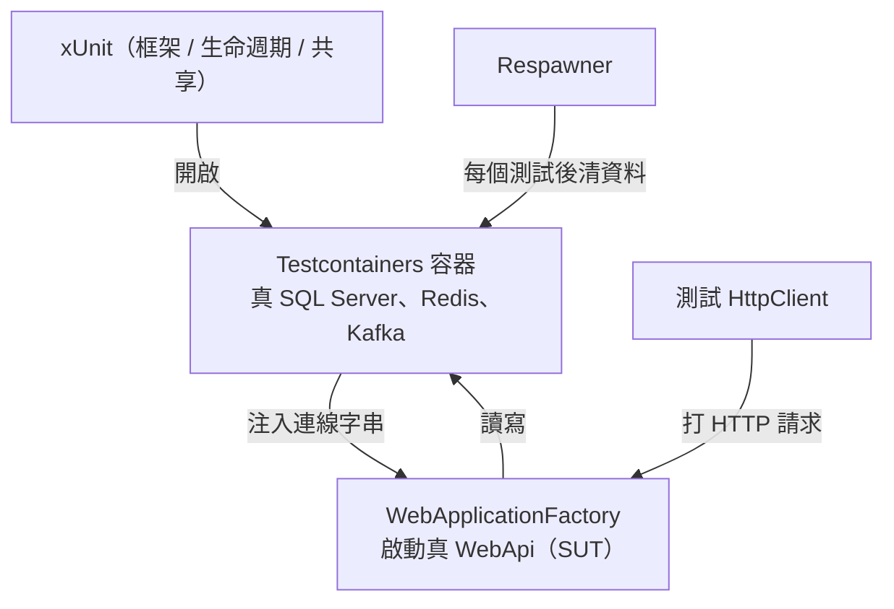
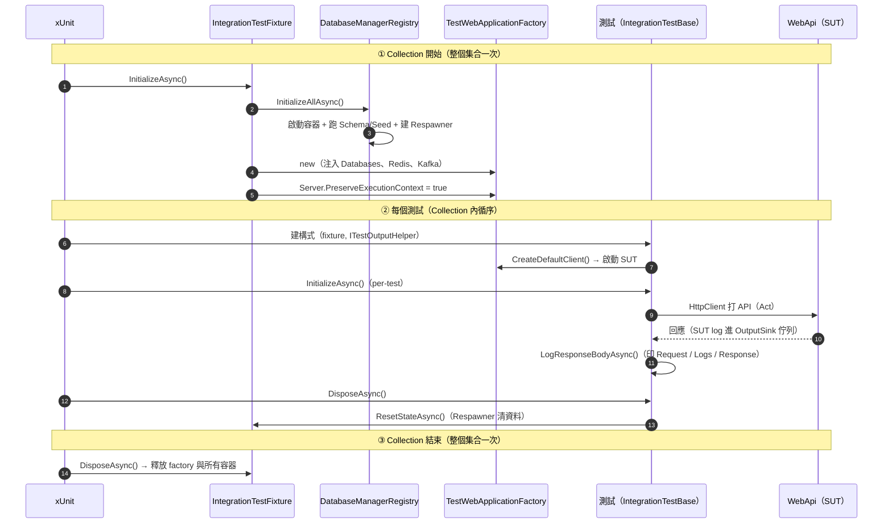
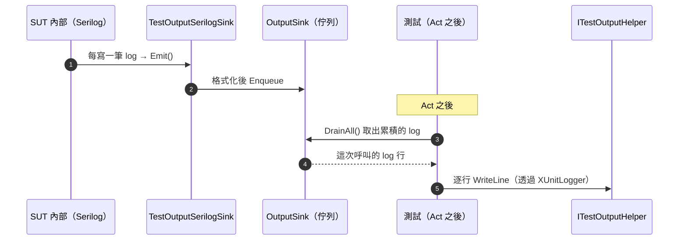
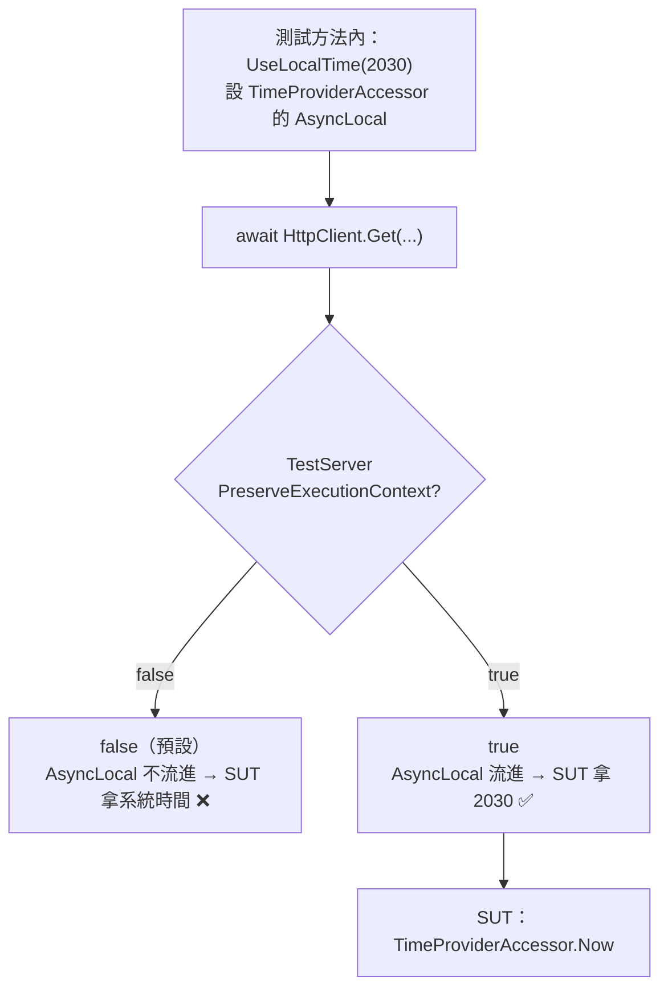
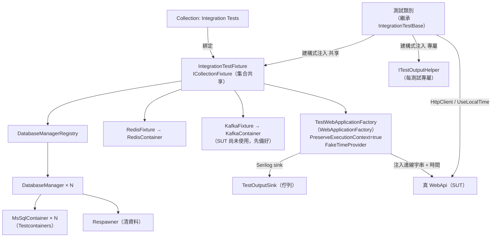

# 整合測試技術轉移指南（WebApplicationFactory + Testcontainers + Respawner + xUnit）

> 這份文件給要接手 / 採用這套整合測試的開發人員，內容**自足**：包含觀念、流程、「為什麼這樣設計」，
> 以及**所有相關類別的完整程式碼**（見第 12 節），不需參照其他文件即可照著建置。

---

## 目錄

- [1. 這套整合測試在測什麼？](#1-這套整合測試在測什麼)
- [2. 四項核心技術各自的角色](#2-四項核心技術各自的角色)
- [3. 各類別的職責](#3-各類別的職責)
- [4. 執行流程順序](#4-執行流程順序最重要)
- [5. 為什麼用 ICollectionFixture？](#5-為什麼用-icollectionfixture不是-iclassfixture也不是建構式)
- [6. 為什麼建構式注入 IntegrationTestFixture？](#6-為什麼測試類別建構式要注入-integrationtestfixture)
- [7. request/response 與 ILogger/Serilog 如何接到 ITestOutputHelper](#7-request--response-與-sut-的-ilogger--serilog-如何接到-itestoutputhelper)
- [8. 時間控制：讓 SUT 的「當下時間」可控](#8-時間控制讓-sut-的當下時間可控)
- [9. Respawner 如何做到測試間隔離](#9-respawner-如何做到測試間隔離)
- [10. 怎麼寫一個新的整合測試](#10-怎麼寫一個新的整合測試onboarding-步驟)
- [11. 常見問題與注意事項](#11-常見問題與注意事項)
- [12. 完整程式碼](#12-完整程式碼)
- [附錄：一眼看懂的關係圖](#附錄一眼看懂的關係圖)

---

## 1. 這套整合測試在測什麼？

不是 mock 一切的單元測試，而是**把真正的 WebApi 跑起來、打真的 HTTP 請求、連真的資料庫與快取**，
驗證「從 HTTP 進來 → 過 Controller / Service / Repository → 讀寫真資料庫 → 回應」整條路是對的。

- **被測對象（SUT, System Under Test）**：`Day23.WebApi`（整個 ASP.NET Core 應用）。
- **真依賴**：SQL Server、Redis、Kafka 都用 **Testcontainers** 開真的 Docker 容器，不是 in-memory 假貨。
- **隔離**：每個測試之間用 **Respawner** 把資料清乾淨，測試互不干擾。
- **可控時間**：用 `FakeTimeProvider` 把 SUT 的「當下時間」變成測試可設定（見第 8 節）。

一句話：**用最接近正式環境的方式，驗證整個 WebApi 的行為。**

---

## 2. 四項核心技術各自的角色

| 技術 | 角色 | 在本專案 |
|------|------|----------|
| **WebApplicationFactory** | 在**記憶體內**啟動整個 WebApi（TestServer），提供 `HttpClient` 直接打它；可覆寫設定與服務註冊 | `TestWebApplicationFactory` |
| **Testcontainers** | 用程式**開真的 Docker 容器**（SQL Server / Redis / Kafka），測試結束自動清掉 | `DatabaseManager` 內的 `MsSqlContainer`、`RedisFixture` 內的 `RedisContainer`、`KafkaFixture` 內的 `KafkaContainer` |
| **Respawner** | 每個測試後把資料庫**資料清空**（只刪資料、不動 schema），達成測試間隔離 | `DatabaseManager.CleanDatabaseAsync()` |
| **xUnit** | 測試框架；提供 fixture 生命週期（`IAsyncLifetime`）、資源共享（`ICollectionFixture`）、測試輸出（`ITestOutputHelper`） | `IntegrationTestFixture`、`IntegrationTestBase`、`IntegrationTestCollection` |

這四者的合作關係：

```text
xUnit（框架 / 生命週期 / 共享）
  └─ 開啟 Testcontainers 容器（真 SQL Server / Redis / Kafka）
        └─ 把容器連線字串注入 WebApplicationFactory（啟動真 WebApi）
              └─ 測試用 HttpClient 打 WebApi → 讀寫容器裡的真資料庫
                    └─ 每個測試後用 Respawner 清資料
```

以下為 Mermaid 版：



---

## 3. 各類別的職責

| 類別 | 職責 | 生命週期 |
|------|------|----------|
| `IntegrationTestCollection` | 定義一個 **xUnit Collection**，宣告要共享 `IntegrationTestFixture` | 靜態定義 |
| `IntegrationTestFixture` | **組合根**：建立/啟動/釋放所有容器與 factory；設 `PreserveExecutionContext`；提供 `ResetStateAsync` | **整個 Collection 一次** |
| `DatabaseManager` | 自建並持有一台 SQL Server 容器；跑 schema/seed；提供連線字串與 DB 操作；Respawner 重置 | 隨 fixture |
| `DatabaseManagerRegistry` | 管理多台資料庫（多個 `DatabaseManager`），統一 Init/Reset/Dispose | 隨 fixture |
| `RedisFixture` | 自建並持有 Redis 容器；提供連線字串 | 隨 fixture |
| `KafkaFixture` | 自建並持有 Kafka 容器；提供 bootstrap servers 與 consumer 驗證 helper（SUT 尚未使用，先備好） | 隨 fixture |
| `TestWebApplicationFactory` | 接收注入的容器 fixture，把連線字串套進 WebApi 設定、接管 log；產生 `HttpClient`；持有 `FakeTimeProvider` | 隨 fixture |
| `IntegrationTestBase` | 測試基底：提供 `HttpClient` / DB 存取 / 時間控制 / log 輸出；每個測試後重置狀態 | **每個測試一次** |
| `TestOutputSink` / `TestOutputSerilogSink` / `XUnitLogger` / `RequestCaptureHandler` | 把 SUT 內部 log 與 request/response 轉發到測試輸出（見第 7 節） | — |

> **關鍵區分：兩個層級的生命週期**
>
> - **Fixture 層（Collection scope）**：容器啟動 / 關閉，**整個測試集合只做一次**（貴的資源共享）。
> - **Base 層（per-test scope）**：每個測試方法前後各跑一次（本專案用來「測試後重置資料」）。

---

## 4. 執行流程順序（最重要）

```text
① Collection 開始（整個測試集合一次）
   xUnit 建立 IntegrationTestFixture → 呼叫 fixture.InitializeAsync()
     ├─ Databases.InitializeAllAsync()
     │    每個 DatabaseManager：啟動 SQL Server 容器 → 跑 Schema/Seed 腳本 → 建立 Respawner
     ├─ Redis.InitializeAsync()：啟動 Redis 容器
     ├─ Kafka.InitializeAsync()：啟動 Kafka 容器
     ├─ new TestWebApplicationFactory(Databases, Redis, Kafka)
     │    （把各容器連線字串記著，稍後注入 WebApi 設定）
     └─ Factory.Server.PreserveExecutionContext = true
          （讓測試設的 AsyncLocal，例如 TimeProviderAccessor 的時間，能流進 SUT 請求管線）

② 每一個測試方法（Collection 內循序執行）
   a. xUnit 建立測試類別 → 建構式注入 (IntegrationTestFixture, ITestOutputHelper)
        → base 建構式：
             - HttpClient = fixture.Factory.CreateDefaultClient(new RequestCaptureHandler())
               （第一次 CreateClient 時，WebApplicationFactory 才真正建起 TestServer / 啟動 WebApi）
             - DatabaseManager / AuditDatabase = fixture.Databases[DatabaseNames.X]
             - Logger = XUnitLogger(這個測試的 ITestOutputHelper)
   b. xUnit 呼叫 base.InitializeAsync()（per-test；本專案不用再做事，表已在 fixture 建好）
   c. 測試方法本體：
        - Arrange：用 TestHelpers / ExecuteAsync 塞測試資料；需要控時就 UseLocalTime(...)
        - Act：HttpClient 打 WebApi（SUT 內部 log 在此累積進 OutputSink 佇列）
        - 輸出：LogResponseBodyAsync() 印出 Request / SUT Logs / Response
        - Assert：驗證回應與資料庫狀態
   d. xUnit 呼叫 base.DisposeAsync()（per-test）
        → Fixture.ResetStateAsync()：Respawner 清空所有資料庫
        → FlurlClient.Dispose() + OutputSink.DrainAll()（清掉殘留 log）

③ Collection 結束（整個測試集合一次）
   xUnit 呼叫 fixture.DisposeAsync() → 釋放 factory 與所有容器
```

以下為 Mermaid 版（時序圖）：



> **同一個 Collection 內的測試是「循序」執行**（xUnit 預設不在 collection 內平行跑）。
> 這一點很重要——第 7 節的「SUT log 佇列」正是靠這個保證才能正確對應到每次呼叫。

---

## 5. 為什麼用 `ICollectionFixture`？（不是 IClassFixture、也不是建構式）

xUnit 有三種「共享範圍」，差別在**貴資源會被建立幾次**：

| 方式 | 共享範圍 | 容器會啟動幾次 |
|------|----------|----------------|
| 建構式 / `Dispose`（預設） | **每個測試方法** | 每個測試都重開一次 → 極慢 ❌ |
| `IClassFixture<T>` | **單一測試類別內** | 每個測試類別各開一次 → 有幾個類別就開幾次 ❌ |
| **`ICollectionFixture<T>`** | **同一 Collection 的所有測試類別** | **整個集合只開一次** ✅ |

啟動一台 SQL Server 容器要好幾秒（甚至更久），如果每個測試 / 每個類別都重開，測試會慢到不可用。
`ICollectionFixture` 讓「開容器」這種昂貴動作**整個測試集合只做一次**，所有測試類別共享，是效能上的關鍵。

實作上：

- `IntegrationTestCollection` 用 `[CollectionDefinition("Integration Tests")]` + `ICollectionFixture<IntegrationTestFixture>` 宣告共享。
- `IntegrationTestBase` 掛 `[Collection("Integration Tests")]`，所以**所有繼承它的測試類別都屬於同一個 collection、共享同一組容器**。

---

## 6. 為什麼測試類別建構式要注入 `IntegrationTestFixture`？

這是 **xUnit 的相依注入機制**：

1. 當一個測試類別屬於某 collection、而該 collection 用 `ICollectionFixture<IntegrationTestFixture>` 宣告了共享物件，
   xUnit 就會**建立一個 `IntegrationTestFixture`（整個 collection 唯一）**，並在建立每個測試類別時，把它**注入建構式**。
2. `ITestOutputHelper` 則是 xUnit 內建、**每個測試各一份**的輸出管道，也由 xUnit 注入建構式。

所以測試類別的建構式簽章長這樣：

```csharp
public XxxTests(IntegrationTestFixture fixture, ITestOutputHelper output)
    : base(fixture, output) { }
```

- `fixture`：**共享的**（容器、factory 都在裡面）。
- `output`：**這個測試專屬的**輸出。

`IntegrationTestBase` 接住這兩者：從 `fixture` 拿共享資源（`Factory`、`Databases`），用 `output` 建立
只屬於這次測試的 `Logger`。**「共享的東西從 fixture 拿、每測試獨立的東西從 output 拿」——這是整個注入設計的核心。**

---

## 7. request / response 與 SUT 的 ILogger / Serilog 如何接到 `ITestOutputHelper`？

這是最容易卡住、也最有價值的部分。分成兩條線：**測試端的 HTTP request/response** 與 **SUT 內部的 log**。

### 7-1. `ITestOutputHelper` 是什麼、為什麼要它

xUnit 不建議在測試裡用 `Console.WriteLine`；要顯示在測試結果裡，要透過 `ITestOutputHelper.WriteLine`。
它由 xUnit **每個測試注入一份**。我們用 `XUnitLogger<T>`（一個 `ILogger` 實作）把它包成標準 `ILogger`，
測試裡就能用 `Logger.LogInformation(...)` 輸出。

### 7-2. HTTP Request body：`RequestCaptureHandler`

問題：`HttpClient` 送出請求後，通常會 **dispose 掉 `request.Content`**，等你拿到回應想印請求內容時已經讀不到。

解法：掛一個 `DelegatingHandler`（`RequestCaptureHandler`），在**送出前**先把 body 緩衝成字串、存進
`request.Options`；測試拿到回應後，從 `response.RequestMessage.Options` 取回來印。

```text
HttpClient（掛 RequestCaptureHandler）
  → 送出前：緩衝 request body 存進 Options
  → 拿到 response 後：從 response.RequestMessage.Options 取回 body 輸出
```

### 7-3. SUT 內部 log（Serilog）：為什麼要「佇列緩衝 + 主動 drain」

這裡是重點。被測 WebApi 用 **Serilog** 記 log。我們想把 SUT 內部（Controller/Service/Middleware）的 log
也印到**當前測試**的 `ITestOutputHelper`，方便測試失敗時診斷。但有個難題：

> **難題**：SUT 在 TestServer 裡處理請求的執行環境，**預設不會延續**呼叫端測試方法的 `AsyncLocal` 脈絡，
> 所以 SUT 內部程式碼**拿不到「當前測試的 `ITestOutputHelper`」**，沒辦法直接寫進去。

解法：**中央佇列緩衝 + 測試主動取出**。

```text
①（fixture 啟動時）TestWebApplicationFactory 在 SUT 的 Serilog 上掛一個自訂 sink：
     TestOutputSerilogSink(OutputSink)

② SUT 內部每寫一筆 log
     → Serilog 觸發 TestOutputSerilogSink.Emit()
     → 格式化後 Enqueue 進 OutputSink（一個 ConcurrentQueue 佇列，掛在 factory 上、集合共享）

③ 測試在 Act 之後呼叫 LogResponseBodyAsync()
     → OutputSink.DrainAll() 取出目前佇列裡累積的所有 log
     → 用 Logger（XUnitLogger → 這次測試的 ITestOutputHelper）逐行印出

④ 測試結束 DisposeAsync 再 DrainAll 一次，清掉殘留，避免污染下一個測試
```

以下為 Mermaid 版（時序圖）：



**為什麼這樣可行？** 因為**同一 collection 的測試是循序執行的**（第 4 節）——在 Act 之後、下一個測試開始前
去 drain 佇列，取出的內容就「正好是這次呼叫產生的 log」，不會跟別的測試交錯。

> 補充：`TestOutputSerilogSink` 的攔截點下在 **Serilog 的 sink 層**（不是 `Microsoft.Extensions.Logging` 的
> `ILoggerProvider`），因為 SUT 改用 Serilog 後，訊息不再流經 MEL 的 provider，必須在 Serilog 這一層接。

### 7-4. 三段式輸出

`LogResponseBodyAsync()` 把一次呼叫整理成三段印出，診斷很直覺：

```text
──────────────────────────────
▶ HTTP Request: POST /products      ← RequestCaptureHandler 緩衝的 request（body 美化縮排）
──────────────────────────────
■ SUT Logs:                          ← OutputSink drain 出的 SUT 內部 log
  [SUT] [Information] [ProductService] ...
──────────────────────────────
◀ HTTP Response: 201                 ← 回應狀態碼與 body（JSON 美化縮排）
{ ... }
```

---

## 8. 時間控制：讓 SUT 的「當下時間」可控

要對「時間戳」做確定性斷言（例如 `CreatedAt` 是不是 2030-06-15），SUT 讀到的「現在」就必須可控。
本專案用 **`FakeTimeProvider`**（`Microsoft.Extensions.Time.Testing`）當假時鐘。

**但關鍵是：SUT 取時間有兩種寫法，控制方式完全不同。搞錯就會「設了時間卻拿到電腦系統時間」。**

### 8-1. 兩種取時間的方式 vs 兩種控制方式

| SUT 怎麼取時間 | 範例 | 控制方式 | 需要 `PreserveExecutionContext`？ |
|----------------|------|----------|-----------------------------------|
| **建構子注入的 `TimeProvider`** | `ProductService`、`HealthController` 用 `_timeProvider.GetUtcNow()` | factory 在 `ConfigureServices` 把 DI 的 `TimeProvider` 換成 `FakeTimeProvider`；用 base 的 `SetTime`/`AdvanceTime`/`ResetTime` 控制（作用在同一個實例） | **不需要** |
| **AsyncLocal 靜態存取器** | `TimeController` 用 `TimeProviderAccessor.Now` | 用 base 的 `UseLocalTime(...)` 在測試方法內設，並**在 fixture 開 `PreserveExecutionContext = true`** | **一定要** |

- **注入版**：因為 SUT 拿的是 DI 容器裡那顆 `TimeProvider`，factory 換成假的、你在測試操作同一顆，自然生效。
- **AsyncLocal 版**：`TimeProviderAccessor` 讀的是 `AsyncLocal<TimeProvider>`，值綁在執行脈絡上——這正是第 7-3 節那個坑：**AsyncLocal 預設不會流進 TestServer 的請求管線**。差別在，log 那邊用「佇列」繞過；時間這邊我們**反而要讓脈絡流進去**，所以打開 `PreserveExecutionContext`。

### 8-2. AsyncLocal 版：為什麼沒開 `PreserveExecutionContext` 就拿到系統時間

```text
測試方法內：UseLocalTime(2030) → TimeProviderAccessor 的 AsyncLocal 設成 fake(2030)
        │
        │ await HttpClient.Get(...)
        ▼
TestServer 請求管線
  ├─ PreserveExecutionContext = false（預設）→ AsyncLocal 沒流進 → SUT 讀到系統時間 ❌
  └─ PreserveExecutionContext = true          → AsyncLocal 流進   → SUT 讀到 2030 ✅
        ▼
SUT：TimeProviderAccessor.Now → fake.GetLocalNow() → 2030
```

以下為 Mermaid 版：



### 8-3. 怎麼做（AsyncLocal 版，實測可行）

**一次性（`IntegrationTestFixture.InitializeAsync()`，建完 factory 後）：**
```csharp
Factory = new TestWebApplicationFactory(Databases, Redis, Kafka);
Factory.Server.PreserveExecutionContext = true;   // ← 沒這行，AsyncLocal 到不了 SUT
```

**base 的 helper（`IntegrationTestBase`）：**
```csharp
private static readonly TimeZoneInfo TaipeiZone = TimeZoneInfo.FindSystemTimeZoneById("Asia/Taipei");

protected IDisposable UseLocalTime(DateTime localWallClock)
{
    var utc = TimeZoneInfo.ConvertTimeToUtc(
        DateTime.SpecifyKind(localWallClock, DateTimeKind.Unspecified), TaipeiZone);

    // 用「建構子」設初始時間，不是 SetUtcNow：SetUtcNow 不能往回設，且預設起始為 2000-01-01
    var fake = new FakeTimeProvider(new DateTimeOffset(utc, TimeSpan.Zero));
    fake.SetLocalTimeZone(TaipeiZone);
    return TimeProviderAccessor.CreateTestScope(fake);   // using 離開時自動還原
}
```

**測試裡（時間設在測試方法內、Act 之前）：**
```csharp
[Fact]
public async Task Xxx()
{
    using var _ = UseLocalTime(new DateTime(2030, 6, 15, 9, 0, 0));   // 台灣本地牆上時間
    var response = await HttpClient.GetAsync("/time");                // SUT 讀到 2030-06-15 09:00
    // Assert ...
}
```

### 8-4. 四個地雷（踩過就白試半天）

| 地雷 | 正確做法 |
|------|----------|
| 沒開 `PreserveExecutionContext`（AsyncLocal 版） | fixture 建完 factory 後設 `Factory.Server.PreserveExecutionContext = true` |
| 時間設在 fixture / `InitializeAsync` | AsyncLocal 流不進測試方法 → **一定設在測試方法內** |
| 用 `SetUtcNow` 設 2000 之前的時間 | `SetUtcNow` 不能往回設 → 改用**建構子** `new FakeTimeProvider(utc)` |
| 只 `SetUtcNow` 沒設時區（讀 `.Now`/本地時間） | `SetLocalTimeZone(...)`；且 `SetUtcNow` 傳 offset=0 的 UTC（`GetLocalNow` 以 Ticks 計算） |

### 8-5. 設了還是拿到系統時間？兩點探針定位

（尤其把這套搬到別的專案卻失效時）在一支測試裡跑一次，看斷在哪：

```csharp
using var _ = /* 你設定時間的方式 */;

var testSide = TimeProviderAccessor.Now;                 // 探針 A：測試端自己讀
var sutSide  = await HttpClient.GetStringAsync("/time"); // 探針 B：SUT 回報它看到的時間
```

| 探針 A | 探針 B | 問題點 |
|:---:|:---:|---|
| ❌ 系統時間 | — | **設定沒生效**：accessor / `CreateTestScope` 有問題，或時間設在測試方法外 |
| ✅ 設定時間 | ❌ 系統時間 | **流動沒生效**：`PreserveExecutionContext` 沒設 / 設在錯的 server |
| ✅ 設定時間 | ✅ 但原端點仍系統時間 | **那條程式路徑沒走 accessor**（某處用了 `DateTime.Now`） |

> 本專案已用 `TimeController`（讀 `TimeProviderAccessor.Now`）+ `TimeControlTests` 實測這一整套，全數通過。

---

## 9. Respawner 如何做到測試間隔離

- **建表只做一次**：容器啟動時（fixture 層）跑 schema 腳本建表，並 `Respawner.CreateAsync` 掃描 schema、
  算出「要清哪些表、什麼順序清」的計畫。
- **每個測試後清資料**：`DisposeAsync → ResetStateAsync → Respawner.ResetAsync`，依外鍵順序**刪掉所有資料列**。
- **只刪資料、不動 schema**：表還在（空的），所以下一個測試不用重建表，快又乾淨。

> 注意：Respawner 是「刪光資料」，**不會保留靜態 seed**。若需要跨測試都存在的種子資料，要用
> `RespawnerOptions.TablesToIgnore` 排除、或每次 reset 後重跑 seed（本專案的 Seed 目錄目前留空，
> 測試改用 `TestHelpers` 在每個測試裡動態塞資料）。

---

## 10. 怎麼寫一個新的整合測試（onboarding 步驟）

**A. 寫一個新的測試類別**：繼承 `IntegrationTestBase`，建構式照抄注入。

```csharp
public class OrdersControllerTests : IntegrationTestBase
{
    public OrdersControllerTests(IntegrationTestFixture fixture, ITestOutputHelper output)
        : base(fixture, output) { }

    [Fact]
    public async Task 建立訂單_應回傳201()
    {
        // Arrange：需要前置資料就用 TestHelpers / DatabaseManager.ExecuteAsync 塞；需要控時就 UseLocalTime(...)
        // Act
        var response = await HttpClient.PostAsJsonAsync("/orders", request);
        await LogResponseBodyAsync(response);   // 印出 Request / SUT Logs / Response

        // Assert：驗回應
        response.Should().Be201Created();
        // 需要時直接查資料庫驗狀態
        var count = await DatabaseManager.QuerySingleAsync<int>("SELECT COUNT(*) FROM orders");
        count.Should().Be(1);
    }
}
```

你**不用**管容器啟動、連線字串、清資料、`PreserveExecutionContext`——base 與 fixture 都處理好了。

**B. 需要新的資料表**：把建表 `.sql` 放到 `TestData/Sql/Schema/{DatabaseName}/`，容器啟動時會自動執行。

**C. 需要第三個資料庫**：在 `DatabaseNames` 加一個常數並納入 `All`，其餘（registry / factory / fixture）
都不用改（見完整程式碼文件第 5 節）。

**D. 需要控制時間**：`using var _ = UseLocalTime(new DateTime(...));` 放在 Act 之前（見第 8 節）。

---

## 11. 常見問題與注意事項

- **一定要有 Docker**：Testcontainers 靠 Docker 開容器；CI/開發機都要能連 Docker daemon。
- **容器啟動較慢**：SQL Server 映像大、啟動要時間；靠 `ICollectionFixture` 整個集合只開一次來攤平成本。
- **測試在 collection 內循序執行**：不要假設同集合測試會平行；「SUT log 佇列」也依賴這個前提。
- **不要在測試裡用 `Console.WriteLine`**：改用 `Logger`（會進 `ITestOutputHelper`）。
- **設定覆寫時機**：`TestWebApplicationFactory` 在 `ConfigureAppConfiguration` 清掉原設定、注入容器連線字串；
  SUT 的連線工廠要在**解析時（resolution）**才讀設定，才能拿到覆寫後的值。
- **每個測試預設是乾淨的資料庫**：靠 `ResetStateAsync`（Respawner）；不要依賴上一個測試留下的資料。
- **時間控制分兩種**：注入版換 DI 即可；AsyncLocal 版一定要 `PreserveExecutionContext = true` 且時間設在測試方法內（見第 8 節）。

---

## 12. 完整程式碼

以下為本套整合測試所有相關類別的完整程式碼（本篇自足，照抄即可建置）。

### 12-1. `Infrastructure/IntegrationTestCollection.cs`

```csharp
namespace Day23.Integration.Tests.Infrastructure;

/// <summary>
/// 整合測試集合定義 - 所有整合測試共享同一組容器（由 IntegrationTestFixture 管理）
/// </summary>
[CollectionDefinition("Integration Tests")]
public class IntegrationTestCollection : ICollectionFixture<IntegrationTestFixture>
{
    public const string Name = "Integration Tests";
}
```

### 12-2. `Infrastructure/IntegrationTestFixture.cs`（組合根）

```csharp
namespace Day23.Integration.Tests.Infrastructure;

/// <summary>
/// 整合測試的組合根 fixture（Collection Fixture）。
/// 以 DatabaseManagerRegistry 管理多台資料庫、以 RedisFixture / KafkaFixture 管理其他容器；
/// 於 InitializeAsync 中啟動各容器後建立 TestWebApplicationFactory 並注入。整個測試集合共用同一組容器。
/// </summary>
public sealed class IntegrationTestFixture : IAsyncLifetime
{
    public DatabaseManagerRegistry Databases { get; } = new(DatabaseNames.All);
    public RedisFixture Redis { get; } = new();
    public KafkaFixture Kafka { get; } = new();
    public TestWebApplicationFactory Factory { get; private set; } = null!;

    public async Task InitializeAsync()
    {
        await Databases.InitializeAllAsync();
        await Redis.InitializeAsync();
        await Kafka.InitializeAsync();

        // 容器啟動後才建立 factory，並注入資料庫登錄器、Redis 與 Kafka
        Factory = new TestWebApplicationFactory(Databases, Redis, Kafka);

        // 讓測試端設定的 AsyncLocal（例如 TimeProviderAccessor 的時間）能流進 TestServer 的請求管線，
        // 否則被測 WebApi 內部讀 TimeProviderAccessor.Now 會拿到系統時間而非測試設定的時間。
        Factory.Server.PreserveExecutionContext = true;
    }

    public async Task DisposeAsync()
    {
        await Factory.DisposeAsync();
        await Kafka.DisposeAsync();
        await Redis.DisposeAsync();
        await Databases.DisposeAllAsync();
    }

    /// <summary>重置整合測試的狀態（清空各資料庫資料），供每個測試之間隔離使用。</summary>
    public Task ResetStateAsync() => Databases.ResetAllAsync();
}
```

### 12-3. `Infrastructure/TestWebApplicationFactory.cs`

```csharp
using Microsoft.Extensions.Configuration;
using Microsoft.Extensions.DependencyInjection;
using Microsoft.Extensions.Time.Testing;
using Serilog;
using Serilog.Events;

namespace Day23.Integration.Tests.Infrastructure;

/// <summary>
/// 整合測試的 WebApplicationFactory。
/// 服務容器由組合根 IntegrationTestFixture 建立後注入本類別，本類別不建立任何容器，
/// 只負責把注入 fixture 的連線資訊套進被測 WebApi 設定，並將 SUT 的 ILogger 輸出導向 OutputSink。
/// </summary>
public class TestWebApplicationFactory : WebApplicationFactory<Program>
{
    private readonly DatabaseManagerRegistry _databases;
    private readonly RedisFixture _redis;
    private readonly KafkaFixture _kafka;
    private readonly FakeTimeProvider _timeProvider;

    /// <summary>累積被測 WebApi 內部的 ILogger 輸出，供測試在每次呼叫後取出並印出。</summary>
    public TestOutputSink OutputSink { get; } = new();

    /// <summary>被測 WebApi 使用的假時間提供者（作用在「DI 注入」的 TimeProvider）。</summary>
    public FakeTimeProvider TimeProvider => _timeProvider;

    public TestWebApplicationFactory(DatabaseManagerRegistry databases, RedisFixture redis, KafkaFixture kafka)
    {
        _databases = databases;
        _redis = redis;
        _kafka = kafka;
        _timeProvider = new FakeTimeProvider(new DateTimeOffset(2024, 1, 1, 0, 0, 0, TimeSpan.Zero));
    }

    protected override void ConfigureWebHost(IWebHostBuilder builder)
    {
        builder.ConfigureAppConfiguration(config =>
        {
            config.Sources.Clear();

            var overrides = new Dictionary<string, string?>
            {
                ["ConnectionStrings:Redis"] = _redis.ConnectionString,
                ["Kafka:BootstrapServers"] = _kafka.BootstrapServers
            };

            // 逐一把登錄器中的資料庫連線字串以「ConnectionStrings:{DatabaseName}」注入，不寫死名稱
            foreach (var (databaseName, manager) in _databases.Managers)
            {
                overrides[$"ConnectionStrings:{databaseName}"] = manager.ConnectionString;
            }

            config.AddInMemoryCollection(overrides);
        });

        builder.ConfigureServices(services =>
        {
            // 替換 DI 的 TimeProvider 為 FakeTimeProvider（供「注入版」時間控制）
            services.Remove(services.Single(d => d.ServiceType == typeof(TimeProvider)));
            services.AddSingleton<TimeProvider>(_timeProvider);

            // SUT 用 Serilog，改用 Serilog sink 攔截，把 SUT log 導入 OutputSink
            services.AddSerilog(configuration => configuration
                .MinimumLevel.Information()
                .MinimumLevel.Override("Microsoft", LogEventLevel.Warning)
                .MinimumLevel.Override("System", LogEventLevel.Warning)
                .WriteTo.Sink(new TestOutputSerilogSink(OutputSink)));
        });

        builder.UseEnvironment("Testing");
    }
}
```

### 12-4. `Infrastructure/IntegrationTestBase.cs`

```csharp
using System.Text.Encodings.Web;
using System.Text.Json;
using Day23.Domain.Utilities;
using Microsoft.Extensions.Logging;
using Microsoft.Extensions.Time.Testing;
using Xunit.Abstractions;

namespace Day23.Integration.Tests.Infrastructure;

/// <summary>
/// 整合測試基底類別 - 使用 Collection Fixture 共享容器
/// </summary>
[Collection("Integration Tests")]
public abstract class IntegrationTestBase : IAsyncLifetime
{
    private static readonly JsonSerializerOptions IndentedJsonOptions = new()
    {
        WriteIndented = true,
        Encoder = JavaScriptEncoder.UnsafeRelaxedJsonEscaping
    };

    private const string Divider = "────────────────────────────────────────────────────────";

    protected readonly IntegrationTestFixture Fixture;
    protected readonly TestWebApplicationFactory Factory;
    protected readonly HttpClient HttpClient;
    protected readonly DatabaseManager DatabaseManager;
    protected readonly DatabaseManager AuditDatabase;
    protected readonly KafkaFixture Kafka;
    protected readonly IFlurlClient FlurlClient;
    protected readonly ILogger Logger;

    protected IntegrationTestBase(IntegrationTestFixture fixture, ITestOutputHelper testOutputHelper)
    {
        Fixture = fixture;
        Factory = fixture.Factory;

        // 掛上 RequestCaptureHandler，讓每個請求送出前先緩衝 body，方便之後輸出
        HttpClient = fixture.Factory.CreateDefaultClient(new RequestCaptureHandler());

        DatabaseManager = fixture.Databases[DatabaseNames.Products];
        AuditDatabase = fixture.Databases[DatabaseNames.Audit];
        Kafka = fixture.Kafka;

        Logger = new XUnitLogger<IntegrationTestBase>(testOutputHelper);
        FlurlClient = new FlurlClient(HttpClient);
    }

    /// <summary>
    /// 依序把這次呼叫的「請求」、SUT 內部 ILogger 訊息、以及「回應」輸出到測試記錄。
    /// </summary>
    protected async Task LogResponseBodyAsync(HttpResponseMessage response)
    {
        LogRequestSection(response.RequestMessage);
        LogSutLogSection();
        await LogResponseSectionAsync(response);
    }

    private void LogRequestSection(HttpRequestMessage? request)
    {
        if (request is null) return;

        request.Options.TryGetValue(RequestCaptureHandler.CapturedBodyKey, out var body);
        Logger.LogInformation("{Divider}\n▶ HTTP Request: {Method} {Uri}", Divider, request.Method, request.RequestUri);
        if (!string.IsNullOrWhiteSpace(body))
        {
            Logger.LogInformation("{Body}", FormatJsonBody(body));
        }
    }

    private void LogSutLogSection()
    {
        var sutLogLines = Factory.OutputSink.DrainAll();
        if (sutLogLines.Count == 0) return;

        Logger.LogInformation("{Divider}\n■ SUT Logs:", Divider);
        foreach (var sutLogLine in sutLogLines)
        {
            Logger.LogInformation("{SutLogLine}", sutLogLine);
        }
    }

    private async Task LogResponseSectionAsync(HttpResponseMessage response)
    {
        var body = await response.Content.ReadAsStringAsync();
        Logger.LogInformation("{Divider}\n◀ HTTP Response: {StatusCode}\n{Body}",
            Divider, (int)response.StatusCode, FormatJsonBody(body));
    }

    private static string FormatJsonBody(string body)
    {
        if (string.IsNullOrWhiteSpace(body)) return body;
        try
        {
            using var document = JsonDocument.Parse(body);
            return JsonSerializer.Serialize(document, IndentedJsonOptions);
        }
        catch (JsonException)
        {
            return body;
        }
    }

    public virtual Task InitializeAsync()
    {
        // 容器與資料表已於組合根 fixture 啟動時建立；每個測試開始前不需再初始化
        return Task.CompletedTask;
    }

    public virtual async Task DisposeAsync()
    {
        await Fixture.ResetStateAsync();      // Respawner 清空各資料庫
        FlurlClient.Dispose();
        Factory.OutputSink.DrainAll();        // 清掉殘留 SUT log
    }

    // ── 時間控制（一）：DI 注入的 TimeProvider（例如 ProductService） ──
    protected void ResetTime() => Factory.TimeProvider.SetUtcNow(new DateTimeOffset(2024, 1, 1, 0, 0, 0, TimeSpan.Zero));
    protected void AdvanceTime(TimeSpan timeSpan) => Factory.TimeProvider.Advance(timeSpan);
    protected void SetTime(DateTimeOffset time) => Factory.TimeProvider.SetUtcNow(time);

    // ── 時間控制（二）：TimeProviderAccessor（AsyncLocal，例如 TimeController） ──
    // 前提：IntegrationTestFixture 已設 Factory.Server.PreserveExecutionContext = true。
    private static readonly TimeZoneInfo TaipeiZone = TimeZoneInfo.FindSystemTimeZoneById("Asia/Taipei");

    /// <summary>
    /// 在測試方法內用 using 呼叫：把「台灣本地牆上時間 localWallClock」灌進 TimeProviderAccessor，
    /// 離開 scope 自動還原。SetUtcNow 不能往回設且預設起始 2000-01-01，故用建構子設初始時間。
    /// </summary>
    protected IDisposable UseLocalTime(DateTime localWallClock)
    {
        var utc = TimeZoneInfo.ConvertTimeToUtc(
            DateTime.SpecifyKind(localWallClock, DateTimeKind.Unspecified), TaipeiZone);

        var fake = new FakeTimeProvider(new DateTimeOffset(utc, TimeSpan.Zero));
        fake.SetLocalTimeZone(TaipeiZone);
        return TimeProviderAccessor.CreateTestScope(fake);
    }
}
```

### 12-5. `Infrastructure/DatabaseNames.cs`

```csharp
namespace Day23.Integration.Tests.Infrastructure;

/// <summary>
/// 資料庫名稱常數。同一名稱同時是：registry 索引鍵、TestData/Sql/{Schema,Seed}/{Name} 目錄名、
/// 以及 SUT 連線字串名（ConnectionStrings:{Name}）。以常數避免打錯字。
/// </summary>
public static class DatabaseNames
{
    public const string Products = "Products";
    public const string Audit = "Audit";
    public static readonly string[] All = [Products, Audit];
}
```

### 12-6. `Infrastructure/DatabaseManager.cs`

```csharp
using Dapper;
using Microsoft.Data.SqlClient;

namespace Day23.Integration.Tests.Infrastructure;

/// <summary>
/// 資料庫管理工具（fixture）：自建並持有一台 SQL Server container，以 DatabaseName 識別。
/// 啟動時依目錄慣例執行 TestData/Sql/Schema/{Name} 與 Seed/{Name} 下的 sql，並建立 Respawner。
/// </summary>
public class DatabaseManager : IAsyncLifetime
{
    private readonly MsSqlContainer _sqlServerContainer;
    private readonly string _databaseName;
    private Respawner? _respawner;

    public DatabaseManager(string databaseName)
    {
        _databaseName = databaseName;
        _sqlServerContainer = new MsSqlBuilder()
                             .WithImage("mcr.microsoft.com/mssql/server:2022-latest")
                             .WithPassword("Your_strong_Password123")
                             .WithCleanUp(true)
                             .Build();
    }

    public string ConnectionString => _sqlServerContainer.GetConnectionString();

    public async Task InitializeAsync()
    {
        await _sqlServerContainer.StartAsync();

        await ExecuteScriptsFromDirectoryAsync(Path.Combine("TestData", "Sql", "Schema", _databaseName));
        await ExecuteScriptsFromDirectoryAsync(Path.Combine("TestData", "Sql", "Seed", _databaseName));

        await using var connection = new SqlConnection(ConnectionString);
        await connection.OpenAsync();
        _respawner = await Respawner.CreateAsync(connection, new RespawnerOptions { DbAdapter = DbAdapter.SqlServer });
    }

    public async Task DisposeAsync() => await _sqlServerContainer.DisposeAsync();

    /// <summary>執行指定目錄下所有 .sql（依檔名排序）；目錄不存在則略過。</summary>
    public async Task ExecuteScriptsFromDirectoryAsync(string relativeDirectory)
    {
        var directory = Path.Combine(AppContext.BaseDirectory, relativeDirectory);
        if (!Directory.Exists(directory)) return;

        foreach (var scriptFile in Directory.GetFiles(directory, "*.sql").OrderBy(path => path))
        {
            var script = await File.ReadAllTextAsync(scriptFile);
            await using var connection = new SqlConnection(ConnectionString);
            await connection.OpenAsync();
            await using var command = new SqlCommand(script, connection);
            await command.ExecuteNonQueryAsync();
        }
    }

    public async Task CleanDatabaseAsync()
    {
        if (_respawner == null)
            throw new InvalidOperationException("Respawner 尚未初始化，請先呼叫 InitializeAsync");

        await using var connection = new SqlConnection(ConnectionString);
        await connection.OpenAsync();
        await _respawner.ResetAsync(connection);
    }

    public async Task<int> ExecuteAsync(string sql, object? parameters = null)
    {
        await using var connection = new SqlConnection(ConnectionString);
        await connection.OpenAsync();
        return await connection.ExecuteAsync(sql, parameters);
    }

    public async Task<T> QuerySingleAsync<T>(string sql, object? parameters = null)
    {
        await using var connection = new SqlConnection(ConnectionString);
        await connection.OpenAsync();
        return await connection.QuerySingleAsync<T>(sql, parameters);
    }
}
```

### 12-7. `Infrastructure/DatabaseManagerRegistry.cs`

```csharp
namespace Day23.Integration.Tests.Infrastructure;

/// <summary>
/// 管理多台資料庫（多個 DatabaseManager）的登錄器，以資料庫名稱索引，統一 Init/Reset/Dispose。
/// </summary>
public sealed class DatabaseManagerRegistry
{
    private readonly IReadOnlyDictionary<string, DatabaseManager> _managers;

    public DatabaseManagerRegistry(params string[] databaseNames)
    {
        _managers = databaseNames.ToDictionary(name => name, name => new DatabaseManager(name));
    }

    public DatabaseManager this[string databaseName] => _managers[databaseName];
    public IReadOnlyDictionary<string, DatabaseManager> Managers => _managers;

    public Task InitializeAllAsync() => Task.WhenAll(_managers.Values.Select(m => m.InitializeAsync()));
    public Task ResetAllAsync() => Task.WhenAll(_managers.Values.Select(m => m.CleanDatabaseAsync()));

    public async Task DisposeAllAsync()
    {
        foreach (var manager in _managers.Values)
        {
            await manager.DisposeAsync();
        }
    }
}
```

### 12-8. `Infrastructure/RedisFixture.cs`

```csharp
namespace Day23.Integration.Tests.Infrastructure;

/// <summary>Redis fixture：自建並持有一個 Redis container，對外提供連線字串。</summary>
public class RedisFixture : IAsyncLifetime
{
    private readonly RedisContainer _redisContainer;

    public RedisFixture()
    {
        _redisContainer = new RedisBuilder().WithImage("redis:7-alpine").WithCleanUp(true).Build();
    }

    public string ConnectionString => _redisContainer.GetConnectionString();
    public async Task InitializeAsync() => await _redisContainer.StartAsync();
    public async Task DisposeAsync() => await _redisContainer.DisposeAsync();
}
```

### 12-9. `Infrastructure/KafkaFixture.cs`

```csharp
using Confluent.Kafka;
using Confluent.Kafka.Admin;

namespace Day23.Integration.Tests.Infrastructure;

/// <summary>
/// Kafka fixture：自建並持有一個 Kafka container，提供 bootstrap servers、topic 建立與 consumer 消費驗證。
/// 目前 SUT 尚未接 Kafka；先備好基礎設施，待 SUT 發布訊息時測試即可用 ConsumeSingleAsync 驗證。
/// </summary>
public class KafkaFixture : IAsyncLifetime
{
    private readonly KafkaContainer _kafkaContainer;

    public KafkaFixture()
    {
        _kafkaContainer = new KafkaBuilder().WithImage("confluentinc/cp-kafka:7.5.3").WithCleanUp(true).Build();
    }

    public string BootstrapServers => _kafkaContainer.GetBootstrapAddress();
    public async Task InitializeAsync() => await _kafkaContainer.StartAsync();
    public async Task DisposeAsync() => await _kafkaContainer.DisposeAsync();

    public async Task EnsureTopicsAsync(params string[] topics)
    {
        using var adminClient = new AdminClientBuilder(new AdminClientConfig { BootstrapServers = BootstrapServers }).Build();
        try
        {
            await adminClient.CreateTopicsAsync(topics.Select(topic => new TopicSpecification
            {
                Name = topic, NumPartitions = 1, ReplicationFactor = 1
            }));
        }
        catch (CreateTopicsException ex) when (ex.Results.All(r => r.Error.Code == ErrorCode.TopicAlreadyExists))
        {
        }
    }

    public async Task<ConsumeResult<Ignore, string>?> ConsumeSingleAsync(
        string topic, TimeSpan timeout, string? groupId = null, CancellationToken cancellationToken = default)
    {
        using var consumer = new ConsumerBuilder<Ignore, string>(new ConsumerConfig
        {
            BootstrapServers = BootstrapServers,
            GroupId = groupId ?? $"integration-test-{Guid.NewGuid():N}",
            AutoOffsetReset = AutoOffsetReset.Earliest,
            EnableAutoCommit = false
        }).Build();

        consumer.Subscribe(topic);

        var deadline = DateTimeOffset.UtcNow.Add(timeout);
        while (DateTimeOffset.UtcNow < deadline && !cancellationToken.IsCancellationRequested)
        {
            var result = consumer.Consume(TimeSpan.FromSeconds(1));
            if (result is not null) return result;
            await Task.Delay(100, cancellationToken);
        }
        return null;
    }
}
```

### 12-10. Log / request 轉發：4 個小類別

`Infrastructure/RequestCaptureHandler.cs`

```csharp
namespace Day23.Integration.Tests.Infrastructure;

/// <summary>
/// 用戶端 DelegatingHandler：在請求送出「之前」把 request body 緩衝成字串存進 Options，
/// 讓測試拿到回應後能從 response.RequestMessage 取回請求內容（送出後 request.Content 會被 dispose）。
/// </summary>
public sealed class RequestCaptureHandler : DelegatingHandler
{
    public static readonly HttpRequestOptionsKey<string?> CapturedBodyKey = new("CapturedRequestBody");

    protected override async Task<HttpResponseMessage> SendAsync(
        HttpRequestMessage request, CancellationToken cancellationToken)
    {
        string? body = null;
        if (request.Content != null)
        {
            await request.Content.LoadIntoBufferAsync();
            body = await request.Content.ReadAsStringAsync(cancellationToken);
        }

        request.Options.Set(CapturedBodyKey, body);
        return await base.SendAsync(request, cancellationToken);
    }
}
```

`Infrastructure/TestOutputSink.cs`

```csharp
using System.Collections.Concurrent;

namespace Day23.Integration.Tests.Infrastructure;

/// <summary>
/// 收集被測 WebApi 內部（TestServer 處理請求期間）透過 ILogger 產生的訊息。
/// TestServer 執行環境不延續呼叫端測試方法的 AsyncLocal，故改用集中佇列暫存，
/// 由測試在每次 Act 後主動取出。因整合測試在同一 Collection 內循序執行，取出當下佇列即這次呼叫的紀錄。
/// </summary>
public sealed class TestOutputSink
{
    private readonly ConcurrentQueue<string> _entries = new();

    public void Enqueue(string message) => _entries.Enqueue(message);

    public IReadOnlyList<string> DrainAll()
    {
        var result = new List<string>();
        while (_entries.TryDequeue(out var message))
        {
            result.Add(message);
        }
        return result;
    }
}
```

`Infrastructure/XUnitLogger.cs`

```csharp
using Microsoft.Extensions.Logging;
using Xunit.Abstractions;

namespace Day23.Integration.Tests.Infrastructure;

/// <summary>將 ILogger 輸出導向 xUnit 的 ITestOutputHelper。</summary>
public sealed class XUnitLogger<T> : ILogger<T>
{
    private readonly ITestOutputHelper _output;

    public XUnitLogger(ITestOutputHelper output) => _output = output;

    public IDisposable? BeginScope<TState>(TState state) where TState : notnull => null;
    public bool IsEnabled(LogLevel logLevel) => true;

    public void Log<TState>(LogLevel logLevel, EventId eventId, TState state, Exception? exception,
        Func<TState, Exception?, string> formatter)
    {
        _output.WriteLine(formatter(state, exception));
        if (exception != null)
        {
            _output.WriteLine(exception.ToString());
        }
    }
}
```

`Infrastructure/TestOutputSerilogSink.cs`

```csharp
using System.Globalization;
using System.Text;
using System.Text.Encodings.Web;
using System.Text.Json;
using Serilog.Core;
using Serilog.Events;
using Serilog.Parsing;

namespace Day23.Integration.Tests.Infrastructure;

/// <summary>
/// Serilog sink：把 SUT 內部（Controller/Service/Middleware）的 log event 格式化後送進 TestOutputSink 累積。
/// 自行走訪 message template 的 token（JSON 字串屬性會換行縮排美化），避免 RenderMessage 加引號轉義。
/// </summary>
public sealed class TestOutputSerilogSink : ILogEventSink
{
    private static readonly JsonSerializerOptions IndentedJsonOptions = new()
    {
        WriteIndented = true,
        Encoder = JavaScriptEncoder.UnsafeRelaxedJsonEscaping
    };

    private readonly TestOutputSink _sink;

    public TestOutputSerilogSink(TestOutputSink sink) => _sink = sink;

    public void Emit(LogEvent logEvent)
    {
        var source = logEvent.Properties.TryGetValue("SourceContext", out var context)
            ? context.ToString().Trim('"')
            : string.Empty;

        var line = $"[SUT] [{logEvent.Level}] [{source}] {RenderMessage(logEvent)}";
        if (logEvent.Exception is not null)
        {
            line += $"\n{logEvent.Exception}";
        }

        _sink.Enqueue(line);
    }

    private static string RenderMessage(LogEvent logEvent)
    {
        var builder = new StringBuilder();
        foreach (var token in logEvent.MessageTemplate.Tokens)
        {
            switch (token)
            {
                case TextToken text:
                    builder.Append(text.Text);
                    break;
                case PropertyToken property:
                    AppendProperty(builder, logEvent, property);
                    break;
            }
        }
        return builder.ToString();
    }

    private static void AppendProperty(StringBuilder builder, LogEvent logEvent, PropertyToken property)
    {
        if (!logEvent.Properties.TryGetValue(property.PropertyName, out var value))
        {
            builder.Append(property.ToString());
            return;
        }

        if (value is ScalarValue { Value: string raw })
        {
            if (TryFormatJson(raw, out var formatted))
            {
                builder.Append('\n').Append(formatted);
            }
            else
            {
                builder.Append(raw);
            }
            return;
        }

        using var writer = new StringWriter();
        value.Render(writer, property.Format, CultureInfo.InvariantCulture);
        builder.Append(writer.ToString());
    }

    private static bool TryFormatJson(string raw, out string formatted)
    {
        formatted = raw;
        if (string.IsNullOrWhiteSpace(raw)) return false;

        var trimmed = raw.TrimStart();
        if (trimmed.Length == 0 || (trimmed[0] != '{' && trimmed[0] != '[')) return false;

        try
        {
            using var document = JsonDocument.Parse(raw);
            formatted = JsonSerializer.Serialize(document, IndentedJsonOptions);
            return true;
        }
        catch (JsonException)
        {
            return false;
        }
    }
}
```

### 12-11. 時間控制相關（SUT 端 + 示範測試）

`src/Day23.Domain/Utilities/TimeProviderAccessor.cs`（AsyncLocal 版）

```csharp
namespace Day23.Domain.Utilities;

/// <summary>
/// 提供 TimeProvider 的存取器（AsyncLocal 版）。
/// SUT 透過 TimeProviderAccessor.Now / UtcNow 取時間；測試用 SetTimeProvider / CreateTestScope 模擬。
/// </summary>
public static class TimeProviderAccessor
{
    private static readonly AsyncLocal<TimeProvider?> CurrentLocal = new();

    public static TimeProvider Current => CurrentLocal.Value ?? TimeProvider.System;
    public static DateTimeOffset Now => Current.GetLocalNow();
    public static DateTime Today => Current.GetLocalNow().Date;
    public static DateTimeOffset UtcNow => Current.GetUtcNow();

    public static void SetTimeProvider(TimeProvider timeProvider)
    {
        ArgumentNullException.ThrowIfNull(timeProvider);
        CurrentLocal.Value = timeProvider;
    }

    public static void ResetToSystem() => CurrentLocal.Value = null;

    public static IDisposable CreateTestScope(TimeProvider timeProvider) => new TestTimeScope(timeProvider);

    private sealed class TestTimeScope : IDisposable
    {
        private readonly TimeProvider? _original;
        public TestTimeScope(TimeProvider timeProvider)
        {
            _original = CurrentLocal.Value;
            SetTimeProvider(timeProvider);
        }
        public void Dispose() => CurrentLocal.Value = _original;
    }
}
```

`src/Day23.WebApi/Controllers/TimeController.cs`（示範端點）

```csharp
using Day23.Domain.Utilities;

namespace Day23.WebApi.Controllers;

/// <summary>時間端點：回傳 SUT 透過 TimeProviderAccessor 取得的當下時間，用來驗證整合測試能否控制時間。</summary>
[ApiController]
[Route("time")]
public class TimeController : ControllerBase
{
    [HttpGet]
    public IActionResult Get()
    {
        return this.Ok(new
        {
            now = TimeProviderAccessor.Now.DateTime,
            utcNow = TimeProviderAccessor.UtcNow
        });
    }
}
```

`Controllers/TimeControlTests.cs`（示範測試，實測通過）

```csharp
using Day23.Integration.Tests.Infrastructure;
using Xunit.Abstractions;

namespace Day23.Integration.Tests.Controllers;

/// <summary>
/// 在真正的整合測試結構（共用 factory + IntegrationTestBase）下，驗證能否控制 SUT 的時間。
/// 前提：IntegrationTestFixture 已設 Factory.Server.PreserveExecutionContext = true。
/// </summary>
public class TimeControlTests : IntegrationTestBase
{
    private sealed record TimeResponse(DateTime Now, DateTimeOffset UtcNow);

    public TimeControlTests(IntegrationTestFixture fixture, ITestOutputHelper testOutputHelper)
        : base(fixture, testOutputHelper)
    {
    }

    [Fact]
    public async Task 設定本地時間後_time端點應回傳該時間()
    {
        using var _ = UseLocalTime(new DateTime(2030, 6, 15, 9, 0, 0));   // Act 之前

        var response = await HttpClient.GetAsync("/time");
        await LogResponseBodyAsync(response);

        response.Should().Be200Ok();
        var result = await response.Content.ReadFromJsonAsync<TimeResponse>();

        result!.Now.Should().Be(new DateTime(2030, 6, 15, 9, 0, 0));
        result.UtcNow.Should().Be(new DateTimeOffset(2030, 6, 15, 1, 0, 0, TimeSpan.Zero));
    }
}
```

### 12-12. `Infrastructure/TestHelpers.cs`（領域 seeding）

```csharp
namespace Day23.Integration.Tests.Infrastructure;

/// <summary>測試輔助工具（領域 seeding 透過 DatabaseManager.ExecuteAsync）。</summary>
public static class TestHelpers
{
    public static ProductCreateRequest CreateProductRequest(string name = "測試產品", decimal price = 100.00m)
        => new() { Name = name, Price = price };

    public static ProductUpdateRequest CreateProductUpdateRequest(string name = "更新產品", decimal price = 200.00m)
        => new() { Name = name, Price = price };

    /// <summary>批量種子產品資料（主資料庫）。</summary>
    public static async Task SeedProductsAsync(DatabaseManager dbManager, int count)
    {
        var tasks = new List<Task>();
        for (var i = 1; i <= count; i++)
        {
            tasks.Add(SeedSpecificProductAsync(dbManager, $"產品 {i:D2}", i * 10.0m));
        }
        await Task.WhenAll(tasks);
    }

    /// <summary>種子特定產品資料（主資料庫）。</summary>
    public static async Task<Guid> SeedSpecificProductAsync(DatabaseManager dbManager, string name, decimal price)
    {
        var productId = Guid.NewGuid();
        var sql = @"INSERT INTO products (id, name, price, created_at, updated_at)
                    VALUES (@Id, @Name, @Price, @CreatedAt, @UpdatedAt)";
        await dbManager.ExecuteAsync(sql, new
        {
            Id = productId, Name = name, Price = price,
            CreatedAt = DateTimeOffset.UtcNow, UpdatedAt = DateTimeOffset.UtcNow
        });
        return productId;
    }
}
```

### 12-13. `GlobalUsings.cs`（測試專案）

```csharp
global using System;
global using System.Net.Http.Json;
global using System.Text.Json;
global using System.Threading.Tasks;
global using Xunit;
global using AwesomeAssertions;
global using AwesomeAssertions.Web;
global using Day23.WebApi;
global using Day23.Application.Dtos;
global using Day23.Domain;
global using Flurl.Http;
global using Microsoft.AspNetCore.Hosting;
global using Microsoft.AspNetCore.Mvc.Testing;
global using Microsoft.Extensions.DependencyInjection;
global using Respawn;
global using Testcontainers.Kafka;
global using Testcontainers.MsSql;
global using Testcontainers.Redis;
```

### 12-14. 測試專案套件（`Day23.Integration.Tests.csproj` 相關部分）

```xml
<ItemGroup>
    <PackageReference Include="Confluent.Kafka" Version="2.5.3"/>
    <PackageReference Include="Microsoft.Data.SqlClient" Version="5.2.2"/>
    <PackageReference Include="Microsoft.Extensions.TimeProvider.Testing" Version="10.1.0"/>
    <PackageReference Include="Respawn" Version="7.0.0"/>
    <PackageReference Include="Testcontainers" Version="4.9.0"/>
    <PackageReference Include="Testcontainers.Kafka" Version="4.9.0"/>
    <PackageReference Include="Testcontainers.MsSql" Version="4.9.0"/>
    <PackageReference Include="Testcontainers.Redis" Version="4.9.0"/>
    <!-- 其餘：xunit、Microsoft.AspNetCore.Mvc.Testing、Flurl.Http、AwesomeAssertions 等 -->
</ItemGroup>

<ItemGroup>
    <!-- 測試資料 SQL（依 DatabaseName 分目錄）：萬用字元納入並保留目錄結構 -->
    <Content Include="TestData\**\*.sql">
        <CopyToOutputDirectory>Always</CopyToOutputDirectory>
    </Content>
</ItemGroup>
```

### 12-15. 測試資料目錄與 SQL（T-SQL）

```text
TestData/Sql/Schema/Products/CreateProductsTable.sql
TestData/Sql/Schema/Audit/CreateAuditLogsTable.sql
TestData/Sql/Seed/                 （目前留空；靜態種子放 Seed/{DatabaseName}/*.sql）
```

```sql
-- TestData/Sql/Schema/Products/CreateProductsTable.sql
IF OBJECT_ID(N'products', N'U') IS NULL
BEGIN
    CREATE TABLE products
    (
        id         UNIQUEIDENTIFIER NOT NULL CONSTRAINT PK_products PRIMARY KEY DEFAULT NEWID(),
        name       NVARCHAR(200)    NOT NULL,
        price      DECIMAL(10, 2)   NOT NULL,
        created_at DATETIMEOFFSET   NOT NULL DEFAULT SYSDATETIMEOFFSET(),
        updated_at DATETIMEOFFSET   NOT NULL DEFAULT SYSDATETIMEOFFSET()
    );
END;
```

---

## 附錄：一眼看懂的關係圖

```text
[Collection("Integration Tests")]
        │  綁定
        ▼
ICollectionFixture<IntegrationTestFixture>   ← 整個集合共享一份（xUnit 注入）
        │  持有
        ├─ DatabaseManagerRegistry ──> N × DatabaseManager ──> N × MsSqlContainer（Testcontainers）
        │                                     └─ Respawner（清資料）
        ├─ RedisFixture ──> RedisContainer（Testcontainers）
        ├─ KafkaFixture ──> KafkaContainer（Testcontainers；SUT 尚未使用，先備好）
        └─ TestWebApplicationFactory（WebApplicationFactory）
                 ├─ 注入容器連線字串 → 啟動真 WebApi（SUT）
                 ├─ Server.PreserveExecutionContext = true（讓 AsyncLocal 流進 SUT）
                 ├─ CreateDefaultClient(RequestCaptureHandler) → HttpClient
                 ├─ FakeTimeProvider（可控時間）
                 └─ Serilog sink → TestOutputSink（佇列）

每個測試類別（繼承 IntegrationTestBase）
        建構式注入 (IntegrationTestFixture 共享, ITestOutputHelper 專屬)
                 ├─ 從 fixture 拿 HttpClient / Databases
                 ├─ 用 output 建 XUnitLogger（Logger）
                 ├─ UseLocalTime(...) 控制 SUT 的當下時間
                 └─ DisposeAsync → Fixture.ResetStateAsync()（Respawner 清資料）
```

以下為 Mermaid 版：



> 本篇為自足文件，完整程式碼見上方第 12 節。
