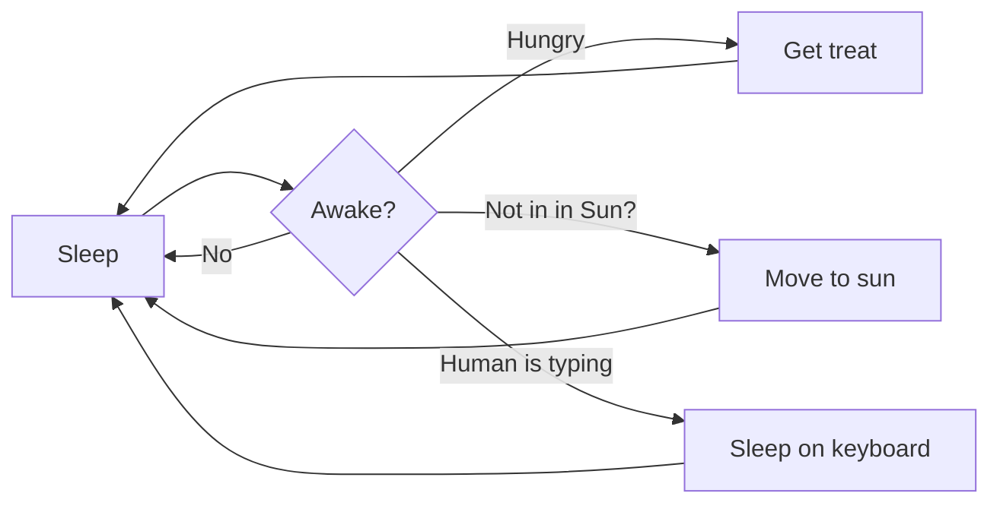

# Visual Studio Code 1.121

在 [LinkedIn](https://www.linkedin.com/showcase/vs-code)、[X](https://go.microsoft.com/fwlink/?LinkID=533687)、[Bluesky](https://bsky.app/profile/vscode.dev) 上追蹤我們

---

_發行日期：2026 年 5 月 20 日_

下載：Windows：[x64](https://update.code.visualstudio.com/1.121.0/win32-x64-user/stable) [Arm64](https://update.code.visualstudio.com/1.121.0/win32-arm64-user/stable) | Mac：[Universal](https://update.code.visualstudio.com/1.121.0/darwin-universal-dmg/stable) [Intel](https://update.code.visualstudio.com/1.121.0/darwin-x64-dmg/stable) [silicon](https://update.code.visualstudio.com/1.121.0/darwin-arm64-dmg/stable) | Linux：[deb](https://update.code.visualstudio.com/1.121.0/linux-deb-x64/stable) [rpm](https://update.code.visualstudio.com/1.121.0/linux-rpm-x64/stable) [tarball](https://update.code.visualstudio.com/1.121.0/linux-x64/stable) [Arm](https://code.visualstudio.com/docs/supporting/faq#_previous-release-versions) [snap](https://update.code.visualstudio.com/1.121.0/linux-snap-x64/stable)

---

歡迎來到 Visual Studio Code 1.121 版本。本次發行新增了內建的 Mermaid 和 HTML 預覽，簡化了 Agent 的終端機工具行為，並讓您可在遠端機器上執行 Agent 工作階段。

- [**遠端 Agent**](#遠端-agentpreview)：從 Agents 視窗監控和控制遠端機器上的 Agent 工作階段。
- [**模型可設定性**](#語言模型)：設定由哪些模型處理產生提交訊息、標題等輕量任務。
- [**Mermaid 圖表預覽**](#markdown-預覽和-notebook-中的-mermaid-圖表)：直接在 Markdown 預覽和 Notebook 中渲染 Mermaid 圖表。
- [**HTML 檔案預覽**](#在整合式瀏覽器中快速開啟-html-檔案)：無需安裝擴充功能即可在整合式瀏覽器中預覽本地 HTML 檔案。
- [**終端機工具最佳化**](#終端機)：透過更多輸出壓縮和背景終端機清理來減少資源和 Token 消耗。

Happy Coding!

---

## Agents

### Agents 視窗（Preview）

我們持續改進 Agents 視窗，這是在上一個版本中作為 Preview 帶入 VS Code Stable 的 Agent 驅動輔助視窗。

您可以透過多種方式開啟 Agents 視窗，包括 VS Code 標題列中的 **Open in Agents** 按鈕。若要了解更多關於其運作方式和可執行的操作，請參閱 [Agents 視窗文件](https://aka.ms/VSCode/Agents/docs)。

您的回饋持續對塑造 Agents 有很大幫助。如果您已經在使用並提供回饋，感謝您！請繼續在 [GitHub 上提交問題](https://github.com/microsoft/vscode/issues)或瀏覽[現有問題](https://github.com/microsoft/vscode/issues?q=state%3Aopen%20label%3A%22agents-window%22)。

我們也持續開發 Agents 視窗中更完整的擴充功能支援，包括擴充功能啟用能解鎖哪些功能，以及各種擴充功能在此環境中應如何運作。無論您想構思利用跨專案執行 Agent 的新場景，還是分享您現有擴充功能在 Agents 視窗中的表現回饋，我們都樂於透過 [GitHub 問題](https://github.com/microsoft/vscode/issues?q=state%3Aopen%20label%3A%22agents-window%22)與您合作。

### 遠端 Agent（Preview）

Agents 視窗實驗性支援在您擁有且可透過 SSH 或 Dev Tunnels 連線的遠端機器上執行 Agent 工作階段。請在我們的文件中了解更多關於[遠端 Agent 工作階段](https://code.visualstudio.com/docs/copilot/concepts/agents#_remote-agent-sessions)的資訊。


#### 連線至遠端

您可以透過兩種方式將 Agents 視窗連線至遠端機器：

- **SSH**：從您現有的 `~/.ssh/config` 項目中選取，或輸入 `user@host`。
- **Dev Tunnels**：從您已在目標機器上執行 `code tunnel` 建立的通道中選取。

#### 運作方式

此功能類似於但不同於 VS Code 的遠端開發擴充功能。Agents 視窗連線至遠端，然後下載並安裝 VS Code CLI（SSH），或透過您啟動的 Dev Tunnel 連線至執行中的 CLI 伺服器。它啟動一個稱為「agent host」的輕量級程序，該程序代管基於 [Copilot SDK](https://www.npmjs.com/package/@github/copilot-sdk) 建構的全新 Agent 迴圈。

需要注意的重要一點是，遠端 agent host 是一個長期執行的程序。即使您的客戶端中斷連線，執行中的工作階段仍會繼續在遠端上執行，因此您可以在遠端 Agent 繼續工作時闔上筆記型電腦。

#### Agent Host Protocol

Agents 視窗與 agent host 之間的連線是一個稱為 **[Agent Host Protocol（AHP）](https://microsoft.github.io/agent-host-protocol/)** 的全新開放協定。我們正將其作為獨立規格在公開環境中開發。

AHP 的關鍵設計原則是它能夠跨多個客戶端同時協調 Agent 工作階段。這是它與 ACP 等其他協定的不同之處。Agent host 管理權威狀態，將其同步至每個連線的客戶端，並透過純 reducer 排序所有變更。

由於 AHP 是開放協定，任何人都可以建構連線至 VS Code CLI 的 agent host 的客戶端，或建構 VS Code 可以連線的 AHP agent host。

### 使用 OpenTelemetry 和 Grafana 進行 Agent 可觀測性

與 Azure Managed Grafana 團隊合作，現在有一個預建的 Azure Managed Grafana 儀表板，用於 VS Code 中 Agent 發出的 OpenTelemetry 訊號。將 VS Code 指向一個轉發至 Azure Application Insights 的 OTel Collector，然後匯入 Azure Managed Grafana 儀表板，即可視覺化 Agent 操作、Token 使用量、聊天工作階段、工具呼叫，以及每模型的回應時間和首 Token 時間（TTFT）。

請參閱[使用 Grafana 監控 AI 編碼 Agent](https://learn.microsoft.com/azure/managed-grafana/grafana-opentelemetry-app-insights#github-copilot) 了解端到端設定，以及[使用 OpenTelemetry 監控 Agent 使用量](https://code.visualstudio.com/docs/copilot/guides/monitoring-agents)了解如何從 VS Code 啟用匯出。


### Claude Agent Auto 權限模式（Preview）

**設定**：`github.copilot.chat.claudeAgent.allowAutoPermissions`

Claude Agent 現在支援 [Auto 模式](https://code.claude.com/docs/en/permission-modes#eliminate-prompts-with-auto-mode)，讓 Claude 無需權限提示即可執行。一個獨立的分類器請求會在操作執行前審查，封鎖任何超出您請求範圍的升級操作、針對未識別基礎設施的操作，或看似由 Claude 讀取的惡意內容驅動的操作。這對長時間執行的任務很有用，您可以減少提示疲勞，同時仍保持背景安全檢查。


若要在權限模式選擇器中看到 Auto 選項，請啟用 `github.copilot.chat.claudeAgent.allowAutoPermissions`。

> **注意**：如果您想要完全無人值守的執行且不進行安全檢查（「YOLO 模式」），請啟用 `github.copilot.chat.claudeAgent.allowDangerouslySkipPermissions` 以顯示「Bypass all permissions」選項。

---

## 語言模型

本次發行包含多項改善，讓您在 VS Code 中設定和管理語言模型的方式更靈活，給予您更多控制權來決定在 VS Code 中不同任務使用哪些模型。請在我們的文件中了解更多關於[語言模型](https://code.visualstudio.com/docs/copilot/customization/language-models)的資訊。

### 設定公用模型

**設定**：`chat.utilityModel`、`chat.utilitySmallModel`

VS Code 在背景使用公用模型（utility models）處理聊天相關任務，例如產生標題、摘要、提交訊息、重新命名建議、提示分類和意圖偵測。預設情況下，這些任務使用 GitHub Copilot 提供的公用模型。

您可以使用自己可用的模型（包括 Bring Your Own Key（BYOK）模型）來處理這些流程：

- `chat.utilityModel`：覆寫用於一般公用流程的模型。
- `chat.utilitySmallModel`：覆寫用於快速、輕量公用流程的模型。建議為此設定選擇快速且低成本的模型。

除非另行設定，兩個設定均使用 **Default**，保持使用 GitHub Copilot 提供的公用模型。

### BYOK 的 Custom Endpoint 供應商（Insiders）

我們現在提供一個全新的 BYOK 供應商——Custom Endpoint 供應商，讓您透過單一設定將任何 Chat Completions、Responses 或 Messages 相容端點接入 Copilot Chat。它取代了舊版的 OpenAI Compatible（`customoai`）供應商，該供應商僅支援 Chat Completions，現已標記為棄用。


當您從此供應商新增模型時，可以選擇其所屬的 API 家族（`chat-completions`、`responses` 或 `messages`）。


> **注意**：Custom Endpoint 供應商目前為 Preview，僅在 VS Code Insiders 中提供。

---

## 整合式瀏覽器

### 在整合式瀏覽器中快速開啟 HTML 檔案

先前，預覽 HTML 檔案需要安裝擴充功能，這對如此常見的操作來說是不必要的摩擦。您現在可以透過在檔案總管中右鍵點擊檔案選擇 **Open in Integrated Browser**，或在檔案已開啟時右鍵點擊編輯器分頁來輕鬆開啟本地 HTML 檔案。您也可以在 HTML 檔案處於活動狀態時選擇編輯器標題列中的 **Preview** 圖示。


### 改善將元素加入聊天的體驗

我們重新設計了元素選取 UI，以支援更豐富的功能和主題支援。

#### 選取元素範圍

您現在可以點擊並拖曳來選取一個元素範圍，更容易定位共用的容器元素。

您現在可以在頁面任何位置右鍵點擊，快速將元素附加至聊天。


---

## 終端機

### Agent 感知的終端機命令

命令列工具先前無法分辨終端機命令是由人類還是 VS Code 的 Agent 流程啟動的，這意味著進度動畫、互動式提示和冗長的格式化可能會封鎖或混淆 Agent 工作階段。

VS Code 現在為 Agent 發起的終端機命令設定 `VSCODE_AGENT` 環境變數。CLI 可以檢查此變數以切換為機器可讀輸出、抑制進度動畫，或跳過會封鎖工作階段的提示。

如果您維護的腳本或 CLI 已經會針對 CI 或其他 Agent 調整行為，您可以對從 Copilot Chat 啟動的命令使用相同的模式。

### 終端機工具的背景執行指示器

先前，當聊天終端機命令在工具呼叫回傳後仍繼續執行時，聊天 UI 看起來像命令已完成，難以分辨工作是否仍在進行中。

工具呼叫現在在終端機仍處於活動狀態時顯示 **Running `<command>` in background - Show**。**Show** 操作讓您可以顯示並聚焦底層終端機。命令完成後，標頭恢復為正常的已完成狀態。

這使得命令仍在背景執行時更加清楚，特別是對於非同步執行或在逾時後被提升為背景執行的命令。

### 背景 Agent 終端機的清理

先前，當您有一個涉及多個終端機命令的長時間聊天工作階段時，每個命令完成後可能會累積背景終端機，用過期的項目填滿終端機清單並消耗資源。

VS Code 現在會在聊天 Agent 建立的背景終端機的命令完成後自動釋放它們，同時仍在聊天 UI 中保留命令輸出。如果您使用 **Show** 顯示了背景終端機，它會保持開啟，讓您可以繼續檢查或與其互動。

這保持了終端機清單的整潔，並在多輪工作階段中減少資源使用。

### 更廣泛的終端機工具輸出壓縮

**設定**：`chat.tools.compressOutput.enabled`

像 `pytest`、`jest`、`cargo test`、`tsc` 和套件安裝工作流程等命令通常會在呈現重要結果之前產生大量進度輸出，浪費 Token 並使模型更難找到相關資訊。

聊天終端機工具現在在將更多種類的冗長命令輸出傳送給模型之前進行壓縮。擴展的覆蓋範圍包括常見的測試執行器、建置工具、Linter、Docker 命令和套件管理員，因此重複的進度資訊和其他低價值輸出會被更頻繁地修剪。

長時間的終端機執行現在更容易讓模型解讀，也更不容易在樣板輸出上花費 Token。

### 敏感終端機提示留在終端機中

終端機命令中的密碼、密語、PIN 或驗證碼提示可能構成風險：如果 Agent 嘗試自行處理這些提示，可能會意外捕獲或重放秘密。

當聊天終端機命令遇到敏感提示時，VS Code 現在會攔截它。在預設權限模式下，聊天會顯示確認對話框，讓您聚焦終端機以直接在那裡輸入秘密。在自動核准流程中，VS Code 會取消命令並告知模型不要重試或請求秘密。

這使憑證不會進入聊天上下文，並防止 Agent 意外暴露或重放敏感輸入。

---

## 語言

### Markdown 預覽和 Notebook 中的 Mermaid 圖表

我們已將 Matt Bierner 的 [Markdown Preview Mermaid Support](https://marketplace.visualstudio.com/items?itemName=bierner.markdown-mermaid) 擴充功能合併至 VS Code，成為名為 `Mermaid Markdown Features` 的全新內建擴充功能。此擴充功能將 [Mermaid 圖表](https://mermaid.js.org/)渲染加入 VS Code 的內建 Markdown 預覽、Notebook 中的 Markdown 儲存格和聊天。

可以在 Markdown 中使用 `mermaid` [圍欄程式碼區塊](https://docs.github.com/en/get-started/writing-on-github/working-with-advanced-formatting/creating-and-highlighting-code-blocks#fenced-code-blocks)建立 Mermaid 圖表：

````

````

以下是圖表在 Markdown 預覽中的樣子：


渲染的 Mermaid 圖表還支援平移和縮放，這使得在不離開預覽的情況下更容易檢查較大的圖表。您也可以右鍵點擊圖表以複製其 Mermaid 原始碼。

### Markdown 預覽中的 YAML 前置資料

**設定**：`markdown.preview.frontMatter`

我們新增了控制 [YAML 前置資料](https://docs.github.com/en/contributing/writing-for-github-docs/using-yaml-frontmatter)在 Markdown 預覽中如何渲染的選項。預設情況下，VS Code 不再隱藏前置資料，而是在預覽頂部將前置資料顯示為表格。


您可以使用 `markdown.preview.frontMatter` 設定來選擇前置資料的顯示方式：

- `table`（預設）：將前置資料渲染為表格。
- `codeBlock`：將前置資料渲染為 YAML 程式碼區塊。
- `hide`：在預覽中隱藏前置資料。

渲染的前置資料還有一個右鍵選單項目，可從預覽中快速開啟此設定。

---

## 已棄用的功能和設定

### 本次發行的新棄用項目

（本次無新增棄用項目。）

### 即將棄用的項目

（本次無即將棄用的項目。）

---

## 感謝

問題追蹤的貢獻：

- [@gjsjohnmurray (John Murray)](https://github.com/gjsjohnmurray)
- [@RedCMD (RedCMD)](https://github.com/RedCMD)
- [@IllusionMH (Andrii Dieiev)](https://github.com/IllusionMH)
- [@albertosantini (Alberto Santini)](https://github.com/albertosantini)

對 `vscode` 的貢獻：

- [@ba-work (Brock Alberry)](https://github.com/ba-work)：outputMonitor：修正兩個導致 Agent 迴圈暫停的誤報家族 [PR #315485](https://github.com/microsoft/vscode/pull/315485)
- [@guomaggie](https://github.com/guomaggie)：程式碼片段注入錯誤時回傳最終答案文字 [PR #316094](https://github.com/microsoft/vscode/pull/316094)
- [@kevin-m-kent](https://github.com/kevin-m-kent)：實驗重複輪詢的終端機輸出差量 [PR #315543](https://github.com/microsoft/vscode/pull/315543)
- [@NikolaRHristov (Nikola Hristov)](https://github.com/NikolaRHristov)：修正：在測試輔助程式中還原 relayCreationTimeoutMs 的 protected 修飾詞 [PR #316049](https://github.com/microsoft/vscode/pull/316049)
- [@SebTardif (Sebastien Tardif)](https://github.com/SebTardif)：修正監聽器洩漏：將 onDidChangeConfiguration 移出 onDidProgressStep 回呼 [PR #314636](https://github.com/microsoft/vscode/pull/314636)
- [@SimonSiefke (Simon Siefke)](https://github.com/SimonSiefke)：修正 lifeCycleMainService 中的記憶體洩漏 [PR #315891](https://github.com/microsoft/vscode/pull/315891)
- [@thernstig (Tobias Hernstig)](https://github.com/thernstig)：修正：將 typescript.tsdk.desc 替換為新的 js/ts.tsdk.path [PR #315268](https://github.com/microsoft/vscode/pull/315268)
- [@thirteenflt (yutingsun)](https://github.com/thirteenflt)：變更 vsc promptD [PR #316733](https://github.com/microsoft/vscode/pull/316733)
- [@yavanosta (Dmitry Guketlev)](https://github.com/yavanosta)：使 InlineCompletionsModel 中的 appearedInsideViewport 成為響應式（#\_289944）[PR #289946](https://github.com/microsoft/vscode/pull/289946)

---

我們非常感謝大家在新功能準備好後儘早試用，所以請經常回來查看並了解最新內容。

> 如果您想閱讀先前 VS Code 版本的發行說明，請前往 [code.visualstudio.com](https://code.visualstudio.com/) 上的 [Updates](https://code.visualstudio.com/updates)。

---

## 術語對照表

| 英文 | 繁體中文 |
|------|----------|
| Agent | Agent |
| Agent Host Protocol (AHP) | Agent Host Protocol（AHP） |
| agent host | agent host |
| Agents window | Agents 視窗 |
| Auto mode | Auto 模式 |
| BYOK (Bring Your Own Key) | BYOK（自帶金鑰） |
| Chat Completions | Chat Completions |
| classifier | 分類器 |
| context window | 上下文視窗 |
| Custom Endpoint | Custom Endpoint |
| Dev Tunnels | Dev Tunnels |
| extension | 擴充功能 |
| fenced code block | 圍欄程式碼區塊 |
| front matter | 前置資料 |
| Integrated Browser | 整合式瀏覽器 |
| Mermaid | Mermaid |
| Notebook | Notebook |
| OpenTelemetry | OpenTelemetry |
| Proposed API | Proposed API |
| reducer | reducer |
| remote agent | 遠端 Agent |
| session | 工作階段 |
| terminal | 終端機 |
| thinking effort | 思考力度 |
| token | Token |
| utility model | 公用模型 |
| workspace | 工作區 |
| YOLO mode | YOLO 模式 |

*資料來源：[Visual Studio Code 1.121 發行說明](https://code.visualstudio.com/updates/v1_121)*
